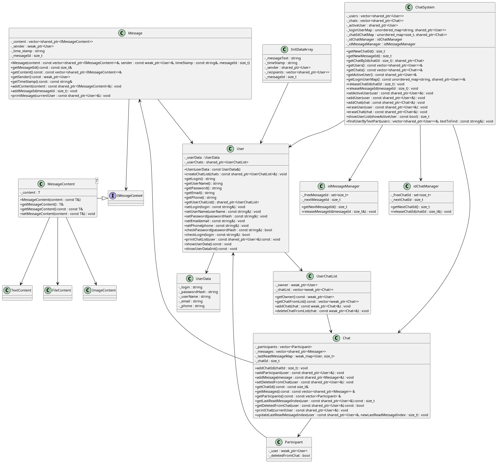
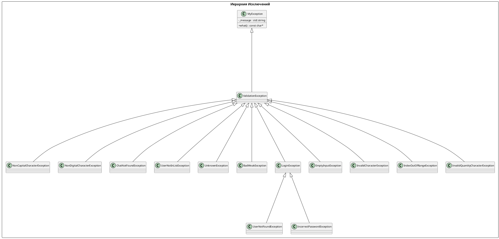

# 💬 ChatBot SHARK v 1.0 2025 made by Yan Batytskiy

**ChatBot** — это консольная система чатов на C++17, поддерживающая регистрацию, авторизацию, создание чатов и отправку сообщений. Проект построен на модульной архитектуре с использованием `smart pointers`, пользовательских исключений и `CMake`.

---

## 🧱 Структура проекта

```
ChatBot/
├── CMakeLists.txt
├── src/
│   ├── chat/
│   ├── user/
│   ├── system/
│   ├── menu/
│   ├── message/
│   └── exception/
├── build/          # генерируется автоматически
└── README.md
```

## 📦 Изменения архитектуры
- кроссплатформенность обработки символов UTF-8 (Linux/Windows/MacOS)
  проверка посимвольного ввода осуществляется на основании UTF8
  с подсчетом количества фактических байт символов.

- введен unordered map с weak_ptr для работы с индексом непрочитанных сообщений _lastReadMessageIndex

- структура UserData для хранения полей данных пользователей вместо 	
  полей класса User с добавлением полей Email и Phone.

- Добавлен std::unordered_map<std::string, std::shared_ptr<User>>  
  _loginUserMap. Поиск переведен на unordered map на O(1)

- хранение паролей с использованием SHA256

- добавлены глобальные ID чата и сообщения, класс для управления ID, включая set для вторичного использования ID удаленных чатов, добавлен вывод ID на экран

- добавден map для удаления отдельных сообщений у пользователя

- начата подготовка к переводу на платформу клиент-сервер

## 📦 Новые функции
- поиск по префиксу в сообщениях на основе дерева
- поиск пользователей на основе префиксного дерева
- удаление отдельных сообщений у пользователей


## 📦 Классы и связи



### ⚠️ Иерархия исключений



---

## ⚙️ Требования

- C++17-совместимый компилятор (`g++`, `clang++`, `MSVC`)
- `CMake` версии **3.16+**
- (рекомендуется) `clangd` для автодополнения и анализа

---

## 🛠️ Сборка и запуск

### 🔧 1. Конфигурация проекта
```bash
cmake -S . -B build
```

### 🧪 2. Сборка
```bash
cmake --build build
```

### 🚀 3. Запуск
```bash
./build/chat_bot
```

---

## ✨ Возможности

- Регистрация и вход пользователей,смена имени и пароля.
- Создание личных и групповых чатов
- Передача сообщений с временем, авторством, указанием количества новых сообщений
- Поиск пользователей по любым символам в Логине
- Поддержка `shared_ptr` / `weak_ptr` для контроля ресурсов
- Валидация ввода и пользовательские исключения
- Удобное меню на русском языке в терминале
- Возможность расширения (аватары, поиск, фильтрация и т.д.)

---

## 📷 Скриншот (пример)

```text
ChatBot 'Shark' Версия 1.0. @2025

1. Регистрация пользователя
2. Войти в ЧатБот
0. Завершить программу
```

---

## 📚 Лицензия

MIT License
